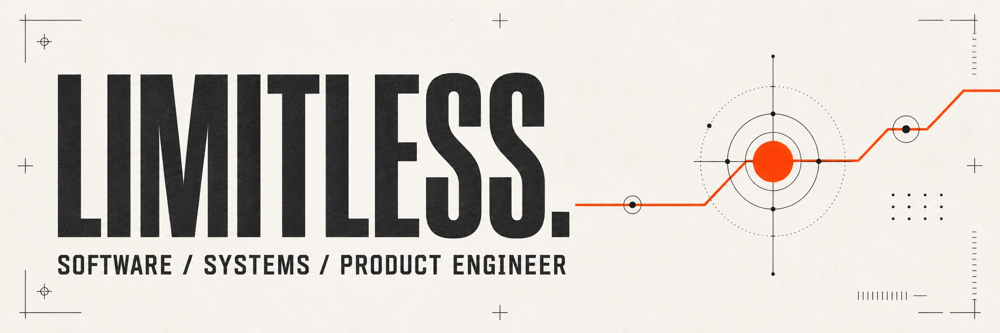
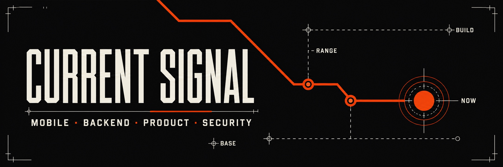
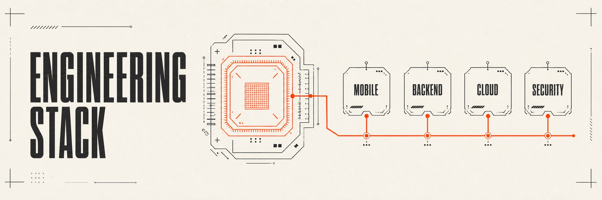

  
  
  
  
  

## Welcome. This is where I build, test, and learn in public.

Hey, I’m Tolulope “Limitless” Favour—a software, systems, and product engineer based in Lagos. I’ve spent the last few years building mobile and backend products across FinTech, prediction markets, HealthTech, and social platforms. These days, I also work close to identity and access: authentication, authorization, and the systems that decide who gets in, what they can do, and how safely software ships.

I use this GitHub to build ideas, test technical instincts, and get closer to how software behaves outside a clean architecture diagram. I’m especially interested in dependable product systems, secure access, and practical AI—agents, LLM workflows, retrieval, search, and automation that earn their place in a real product.

<table>
  <tr>
    <td width="50%" valign="top">
      
        
      At <a href="https://www.gtbank.com/">Guaranty Trust Bank</a>, I focus on authentication, authorization, secure access, and helping teams deliver those systems safely.
    </td>
    <td width="50%" valign="top">
      
        
      I’m most at home where mobile, backend, and product thinking meet—turning a loose idea into software that makes sense to users and holds up in production.
    </td>
  </tr>
  <tr>
    <td width="50%" valign="top">
      
        
      I’m exploring AI engineering through agents, LLM workflows, embeddings, retrieval, search, automation, and the less glamorous work of evaluating whether any of it is actually useful.
    </td>
    <td width="50%" valign="top">
      
        
      Lagos, Nigeria · WAT (UTC+1). I build for users and work with teams well beyond the timezone.
    </td>
  </tr>
</table>

## A few systems with my fingerprints on them.

<table>
  <tr>
    <td width="120" align="center" valign="middle">
      
    </td>
    <td valign="middle">
      <strong><a href="https://www.gtbank.com/">Guaranty Trust Bank</a></strong>
        
      Right now I’m at Guaranty Trust Bank, working mainly on authentication and authorization. My focus is secure access: making sure the right people and systems get the right level of access, and helping teams deliver those flows safely. Having built products before moving this close to security helps—I understand the pressure to ship and still know where shortcuts become expensive.
    </td>
  </tr>
  <tr>
    <td width="120" align="center" valign="middle">
      
    </td>
    <td valign="middle">
      <strong><a href="https://www.bayse.markets/">Bayse Markets</a></strong>
        
      Before GTBank, I led mobile delivery at GoWagr—now Bayse Markets. I worked on the parts users feel immediately: sign-in, payments, escrow, USDT wallet flows, notifications, and the testing needed to trust them. Seeing the product grow into a larger prediction-market platform was a good reminder that solid foundations outlive a rebrand.
    </td>
  </tr>
</table>

### Earlier chapters, same pattern

- **Sealth:** Helped turn health schedules, medical records, and medication alerts into a secure Flutter experience backed by GCP and Firebase.
- **DoyarPay:** Connected modern mobile UX to the less-glamorous realities of financial infrastructure: Paystack, subscriptions, SOAP/XML, fees, and real-time transaction updates.
- **Sturrd:** Helped turn an early social-product idea into a real-time mobile experience spanning chat, location-aware discovery, deep links, notifications, and monetization. It taught me how quickly product decisions become systems decisions.

  
  
  
  
  
  
  
  
  
  
  
  
  
  
  
  
  

<strong>The full toolkit</strong> — because icons only tell half the story

 

**Mobile & product:** Flutter · Dart · Swift · Java / Android · Firebase Auth · Cloud Firestore · Realtime Database · Cloud Functions · FCM · Dynamic Links · Google Maps & Places

**Backend & data:** TypeScript · JavaScript · Node.js · Python · SQL · REST · SOAP · JSON · XML · PostgreSQL · MySQL · Payment & wallet integrations

**Cloud & delivery:** AWS · Azure · GCP · Docker · Kubernetes · Git · GitHub · Postman · Jira · Confluence · Agile · Scrum · DevOps · CI/CD

**AI & exploration:** LLM workflows · Agents · Embeddings · Retrieval and search · AI-assisted automation · Evaluation

**Security & systems:** OWASP · API security · Secure SDLC · Vulnerability assessment · Threat analysis · Burp Suite · Metasploit · Finacle

I also [write](https://limitlessfavour.com/writing) when I have something useful to say and [speak](https://limitlessfavour.com/speaking) when a live conversation will do the idea more justice.

<strong>GitHub signal</strong> — stats, streaks, and the receipts

 

  

  

## Let’s build something that earns its complexity.

I like difficult product problems—especially where mobile, backend, identity, or AI have to work as one system. [Bring me one](mailto:oketolulope3@gmail.com).
